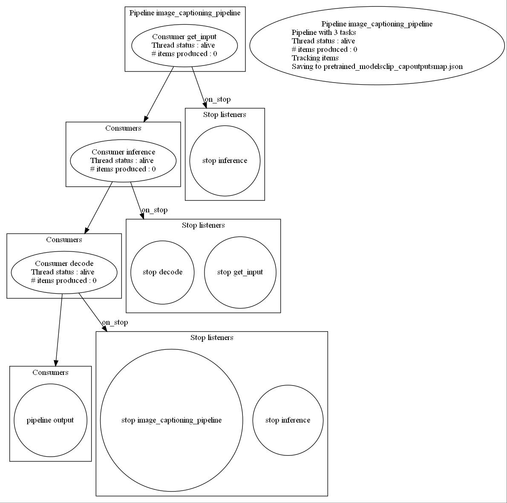

# :yum: Image captioning

This project is still experimental and models have not been fine-tuned yet : in theory it should work but it has not been tested yet. Furthermore, due to weights convertion (from pytorch to tensorflow), performances may be slightly degraded\*. It is the reason why I will try to fine-tune a bit the models in the next updates. 

\* I have tested the convertion by comparing outputs and the difference is really small (less than 0.001 at most) but even this small difference can make the generation different. 

**NEW : [CHANGELOG](https://github.com/yui-mhcp/yui-mhcp/blob/main/CHANGELOG.md) file ! Check it to have a global overview of the latest modifications !** :yum:

## Project structure

```bash

├── custom_architectures
│   ├── transformers_arch
│   │   └── clip_cap_arch.py    : ClipCap architecture (Mapper + main architecture)
│   └── clip_arch.py        : CLIP architecture (used as image encoder)
├── custom_layers
├── custom_train_objects
├── datasets
├── hparams
├── loggers
├── models
│   ├── image_captioning
│   │   └── clip_cap.py     : ClipCap main class
│   ├── siamese         : the CLIP model is used as image encoder
├── pretrained_models
├── unitest
├── utils
└── image_captioning.ipynb
```

Check [the main project](https://github.com/yui-mhcp/base_dl_project) for more information about the unextended modules / structure / main classes. 

\* Check my [Siamese Networks project](https://github.com/yui-mhcp/siamese_networks) for more information about the `models/siamese` module

## Available features

You can check the `image_captioning` notebook for a concrete demonstration

## Available models

### Model architectures

Available architectures :
- [ClipCap](https://arxiv.org/abs/2111.09734)

### Model weights

I do not have fine-tuned any model yet, so you can get pretrained weights [in the official project](https://github.com/rmokady/CLIP_prefix_caption) (currently, only the `transformer_weights` is supported). The [CLIP](https://openai.com/blog/clip/) encoders are automatically downloaded when executing the example's notebook.

## Usage and demonstration

### Demonstration

You can find some illustration on [the official project](https://github.com/rmokady/CLIP_prefix_caption)

### Installation and usage

1. Clone this repository : `git clone https://github.com/yui-mhcp/image_captioning.git`
2. Go to the root of this repository : `cd image_captioning`
3. Install requirements : `pip install -r requirements.txt`
4. Open `image_captioning` notebook and follow the instruction !

## TO-DO list :

- [x] Make the TO-DO list
- [x] Comment the code
- [x] Implement ClipCap Transformers mapper
- [ ] Implement ClipCap MLP mapper
- [ ] Add pretrained weights for French
- [ ] Fine-tune GPT-2 with Transformers mapper

## Pipeline-based prediction

The `ClipCap` model supports the pipeline-based prediction, meaning that all the tasks you see in the below graph are multi-threaded. Check the [data_processing project](https://github.com/yui-mhcp/data_processing) for a better understanding of the `producer-consumer` framework. 




## Contacts and licence

You can contact [me](https://github.com/yui-mhcp) at yui-mhcp@tutanota.com or on [discord](https://discord.com) at `yui#0732`

The objective of these projects is to facilitate the development and deployment of useful application using Deep Learning for solving real-world problems and helping people. 
For this purpose, all the code is under the [Affero GPL (AGPL) v3 licence](LICENCE)

All my projects are "free software", meaning that you can use, modify, deploy and distribute them on a free basis, in compliance with the Licence. They are not in the public domain and are copyrighted, there exist some conditions on the distribution but their objective is to make sure that everyone is able to use and share any modified version of these projects. 

Furthermore, if you want to use any project in a closed-source project, or in a commercial project, you will need to obtain another Licence. Please contact me for more information. 

For my protection, it is important to note that all projects are available on an "As Is" basis, without any warranties or conditions of any kind, either explicit or implied. However, do not hesitate to report issues on the repository's project or make a Pull Request to solve it :smile: 

If you use this project in your work, please add this citation to give it more visibility ! :yum:

```
@misc{yui-mhcp
    author  = {yui},
    title   = {A Deep Learning projects centralization},
    year    = {2021},
    publisher   = {GitHub},
    howpublished    = {\url{https://github.com/yui-mhcp}}
}
```

## Notes and references

Github projects :
- [ClipCap project](https://github.com/rmokady/CLIP_prefix_caption) : official ClipCap implementation
- [CLIP project](https://github.com/openai/clip) : official CLIP implementation
- [My SiameseNetwork project](https://github.com/yui-mhcp/siamese_networks) : more information about the CLIP architecture and how it works

- Papers :
- [ClipCap: CLIP Prefix for Image Captioning](https://arxiv.org/abs/2111.09734) : official ClipCap paper
- [CLIP blog](https://openai.com/blog/clip/) : official OpenAI's blog post about CLIP
